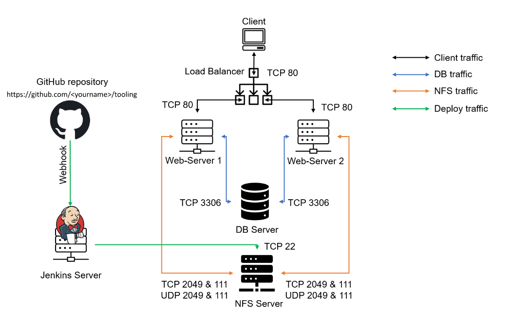
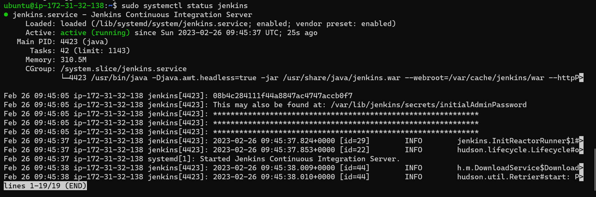
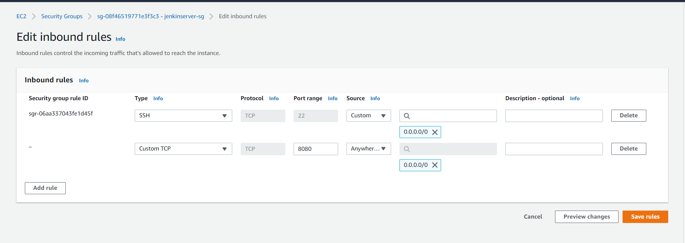

## Task
Enhance the architecture prepared in Project 8 by adding a Jenkins server, and configuring a job to automatically deploy source code changes from Git to the NFS server.
Here is what your updated architecture will look like upon completion of this project:


### Step 1 – Install the Jenkins server
1. Create an AWS EC2 server based on Ubuntu Server 20.04 LTS and name it *"Jenkins"*
2. Install JDK (since Jenkins is a Java-based application)
   
`sudo apt update`
`sudo apt install default-jdk-headless`

3. Install Jenkins
```
wget -q -O - https://pkg.jenkins.io/debian-stable/jenkins.io.key | sudo apt-key add -
sudo sh -c 'echo deb https://pkg.jenkins.io/debian-stable binary/ > \
    /etc/apt/sources.list.d/jenkins.list'

sudo apt update

sudo apt-get install jenkins
```
4. Make sure Jenkins is up and running
  
`sudo systemctl status jenkins`



5. By default Jenkins server uses TCP port 8080 – open it by creating a new Inbound Rule in your EC2 Security Group

 
