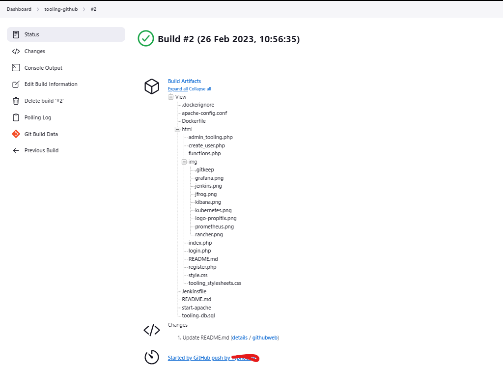
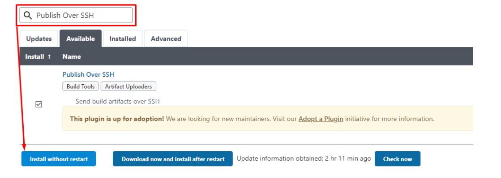

## Task
Enhance the architecture prepared in Project 8 by adding a Jenkins server, and configuring a job to automatically deploy source code changes from Git to the NFS server.
Here is what your updated architecture will look like upon completion of this project:


### Step 1 – Install the Jenkins server
1. Create an AWS EC2 server based on Ubuntu Server 20.04 LTS and name it *"Jenkins"*
2. Install JDK (since Jenkins is a Java-based application)
   
`sudo apt update`
`sudo apt install default-jdk-headless`

3. Install Jenkins
```
wget -q -O - https://pkg.jenkins.io/debian-stable/jenkins.io.key | sudo apt-key add -
sudo sh -c 'echo deb https://pkg.jenkins.io/debian-stable binary/ > \
    /etc/apt/sources.list.d/jenkins.list'

sudo apt update

sudo apt-get install jenkins
```
4. Make sure Jenkins is up and running
  
`sudo systemctl status jenkins`


5. By default Jenkins server uses TCP port 8080 – open it by creating a new Inbound Rule in your EC2 Security Group

 

 6. Perform initial Jenkins setup.
From your browser access:

<http:/Jenkins-Server-Public-IP-Address-or-Public-DNS-Name:8080>

You will be prompted to provide a default admin password

 

Retrieve it from your server:

`sudo cat /var/lib/jenkins/secrets/initialAdminPassword`


Then you will be asked which plugings to install – choose suggested plugins.

 

Once plugin installation is done – create an admin user and you will get your Jenkins server address.

The installation is completed!

 

### Step 2 – Configure Jenkins to retrieve source codes from GitHub using Webhooks
In this part, we will learn how to configure a simple Jenkins job/project (these two terms can be used interchangeably). This job will be triggered by GitHub webhooks and will execute a ‘build’ task to retrieve codes from GitHub and store it locally on Jenkins server.
1. Enable webhooks in your GitHub repository settings. 
Like so:

 

2. Go to Jenkins web console, click "New Item" and create a "Freestyle project"

 

To connect your GitHub repository, you will need to provide its URL, you can copy it from the repository itself

 

- In the configuration of your Jenkins freestyle project choose Git repository, and provide there the link to your Tooling GitHub repository and credentials (user/password) so Jenkins could access files in the repository.

 

Save the configuration and let us try to run the build. For now, we can only do it manually.
Click the "Build Now" button, if you have configured everything correctly, the build will be successful and you will see it under **#1**


>You can open the build and check in "Console Output" if it has run successfully.

But this build does not produce anything and it runs only when we trigger it manually. Let us fix it.

3. Click "Configure" your job/project and add these two configurations


Configure "Post-build Actions" to archive all the files – files resulting from a build are called "artifacts".

Now, go ahead and make some changes in any file in your GitHub repository (e.g. README.MD file) and push the changes to the master branch.

You will see that a new build has been launched automatically **(by webhook)** and you can see its results – artifacts, saved on the Jenkins server.



>You have now configured an automated Jenkins job that receives files from GitHub by webhook trigger (this method is considered as **‘push’** because the changes are being ‘pushed’ and file transfer is initiated by GitHub). 

There are also other methods: trigger one job (downstream) from another (upstream), poll GitHub periodically and others.

- By default, the artifacts are stored on the Jenkins server locally
  
`ls /var/lib/jenkins/jobs/tooling_github/builds/<build_number>/archive/`

### Step 3 – Configure Jenkins to copy files to NFS server via SSH
Now we have our artifacts saved locally on Jenkins server, the next step is to copy them to our NFS server to **/mnt/apps** directory.

Jenkins is a highly extendable application and there are 1400+ plugins available. We will need a plugin that is called **"Publish Over SSH"**.

1. Install the "Publish Over SSH" plugin.
>On the main dashboard select *"Manage Jenkins"* and choose the "Manage Plugins" menu item.
On the "Available" tab search for the *"Publish Over SSH" *plugin and install it




